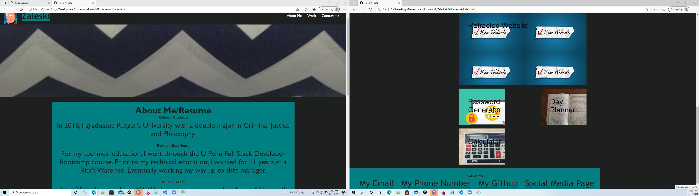

# <Zaleski-02-Homework>
## Description
Provide a short description explaining the what, why, and how of your project. Use the following questions as a guide:
- The motivation behind this project was to create my own portfolio page, while given no code.  
- This project was done to help hone my skills on the skills Ive gathered over the two weeks and apply them to see if I have learned them or not.
- During my time working on this project, I have gained a new appreciation for those who are adept at building code from the ground up, its a lot more work than I would have thought.
- During the work, I realized just how hard code can be to read at the end of you work, because selectors can be all over the place.  So this taught me the importance of commenting and consolidating

## Usage
For this project, we were given a simple webpage and told to make it fit the acceptance criteria:
-GIVEN a webpage meets accessibility standards
-WHEN I view the source code
-THEN I find semantic HTML elements
-WHEN I view the structure of the HTML elements
-THEN I find that the elements follow a logical structure independent of styling and positioning
-WHEN I view the image elements
-THEN I find accessible alt attributes
-WHEN I view the heading attributes
-THEN they fall in sequential order
-WHEN I view the title element
-THEN I find a concise, descriptive title

https://kingcrowz.github.io/Zaleski-01-homework/

 

## Grading Requirements

This homework is graded based on the following criteria: 

### Technical Acceptance Criteria: 40%

* Satisfies all of the above acceptance criteria.

### Deployment: 32%

* Application deployed at live URL.

* Application loads with no errors.

* Application GitHub URL submitted.

* GitHub repository contains application code.

### Application Quality: 15%

* Application resembles the mock-up functionality provided in the homework instructions.

### Repository Quality: 13%

* Repository has a unique name.

* Repository follows best practices for file structure and naming conventions.

* Repository follows best practices for class/id naming conventions, indentation, quality comments, etc.

* Repository contains multiple descriptive commit messages.

* Repository contains quality readme with description, screenshot, link to deployed application.

## Review

You are required to submit BOTH of the following for review:

* The URL of the deployed application.

* The URL of the GitHub repository that contains your code. Give the repository a unique name and include a README file that describes the project.

- - -
© 2021 Trilogy Education Services, LLC, a 2U, Inc. brand. Confidential and Proprietary. All Rights Reserved.
